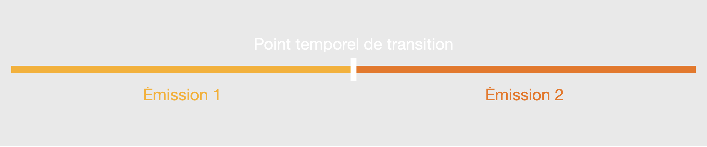

# Segmentation Intelligente Programmes Radio

## Objectifs

Détecter l'horaire réel de début et de fin d'un programme radio pris au milieu d'un ensemble d'autres programmes. On peut parler de :
- Segmentation temporelle des programmes radio
- Détection des bornes temporelles dans les émissions radio
- Repérage des segments de contenu radio
- Identification des transitions de programmes radio

## Objectif global

L'objectif de cette partie de *Recherche et Développement* est de régler le soucis du **décalage temporel imprévisible** des programmes radio. Par exemple, une émission radio prévue de **7h à 8h** peut être réellement diffusée de **7h05 à 8h07**. Comme l'utilisateur souhaite écouter le programme dans son **horaire réel**, il faut trouver une solution à ce problème *d'imprévu temporel* qui est la **détection des horaires réels d'une émission**. Pour ce faire, nous utilisons dans ce projet de R&D de l'**intelligence artificielle** pour la détection de **début** et **fin** d'un programme.

## Première approche - Décembre 2024

### Généralités

Dans une première approche, je vais tenter d'utiliser un modèle d'**IA** pour détecter le *début* (souvent marqué par un **jingle**, un **changement de voix**, une **prise de parole après un silence**...) et la *fin* d'un programme radio (souvent marqué par un **jingle**, un **long silence**...). 

### Intégration de la détection d'horaire réelle à l'enregistrement

Pour détecter l'*horaire réelle dans les enregistrements*, je vais utiliser une approche **hybride**.

> Prenons l'exemple d'un programme qui **est annoncé** (par la radio) commencer à **7h** et se terminer à **8h**.
>
> *Nb : Pour cet exemple, nous allons nous concentrer sur le cas d'un enregistrement **non-live**.*
> - L'enregistrement par *ffmpeg* d'un **fichier MP3** de **7h** à **8h10** (on prend une *marge de 10min* afin d'anticiper les possibles *décalages temporels* et prendre l'intégralité de l'émission).
> - Pendant l'enregistrement, le modèle d'IA **analyse le flux audio en parallèle** pour détecter le **début** et la **fin** et stocker les **timestamps correspondants**.
> - À la **fin de l'enregistrement**, le **fichier MP3** enregistré par ffmpeg (enregistrement du flux de *7h* à *8h10*) est **cropé par l'IA** en utilisant les **timestamps** stockés précédement.
>
> - Avec cette approche *en parallèle*, le temps *d'enregistrement + crop* est réduit et si jamais les time-stamps donnés par l'IA semblent *absurdes*, il reste un *enregistrement complet de l'emission* (avec des bouts en trop, dus à la marge et/ou le décalage temporel imprevu).

## Solutions techniques

### Utilisation du modèle d'IA VGGISH pour détecter les transitions

Dans cette *première tentative* de détection des débuts et fins d'émissions radios, j’utilise le modèle d’IA **VVGISH** comme un **outil** dans la **détection des transitions** entre les programmes.

https://github.com/tensorflow/models/blob/master/research/audioset/vggish/README.md

#### 1. Traiter le signal

Cette IA **découpe** l'audio entrant en très courtes **segments** (synonyme : **fenêtre temporelle**) pour transformer par la suite chaque segment en un objet mathématique, un **embedding**.

>
> Un **embedding** est une *représentation numérique* d'un objet (comme un mot, une phrase ou un segment d'audio) en un *vecteur* (objet mathématique) avec un *nombre de dimensions élevé* (par exemple, 256, 512, ou 1024 dimensions), contenant une **multitude d’informations** compressées sur les **propriétés des objets**.  
*Exemple* : Dans notre cas, l’objet est un **signal vidéo**, les propriétés compressées peuvent donc être les *propriétés perceptuelles du son*, des informations sur les *hauteurs des notes*…).

#### 2. Trouver les transitions

Une fois l'**audio** transformé en une multitude d'**embeddings** (vecteurs), on calcule les **distances** entre les vecteurs pour en déduire si s'agit d'une **transition** ou non.
> Nb : Pour identifier si il y a une **transition** entre dans l'audio, on  compare deux **embeddings consécutifs**. En calculant la **distance** entre ces deux objets, on peut savoir si ils sont **très différents** ou non (donc si les **propriétés** de deux **segments audios** sont très différentes). Dans le cas où la **distance** entre deux objets est **très grande**, on considère qu'il y a une **transition** entre les **deux segments consécutifs**.  

*Commnent évaluer à partir de quand la distance est jugée **suffisament grande** pour marquer une **transition** ?*  
> Pour évaluer la *distance minimale* pour marquer une *transition*, on établit un **seuil** (*threshold*) que la distance doit **dépasser**.

Compte-tenu de la **faible longueur** des segments (**0.96 sec**) (définie dans les paramètres du modèle dans le fichier *'vggish_pca_params.npz'*), on considère la détection d'une **transition entre deux segments** comme un **point temporel**.

On ne considère donc pas de **points temporels** de *début* ou de *fin*, mais uniquement des **points de transitions entre deux programmes** (un point temporel correspond à la *fin* du programme précédent le point temporel, et au *début* du programme suivant le point temporel).

  

> En bref, l'utilisation de la transformation en objets permettant la comparaison de segments audios entre eux et leur comparaison permet de détecter les points de transition entre les programmes, et donc de trouver le début et la fin de chacuns.**

